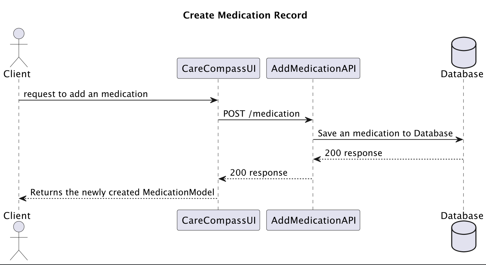
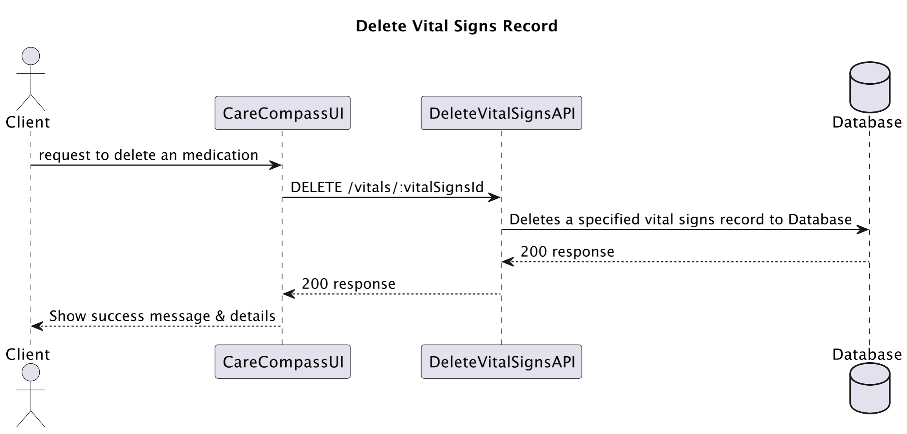
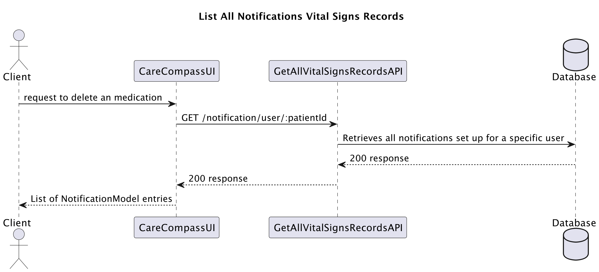
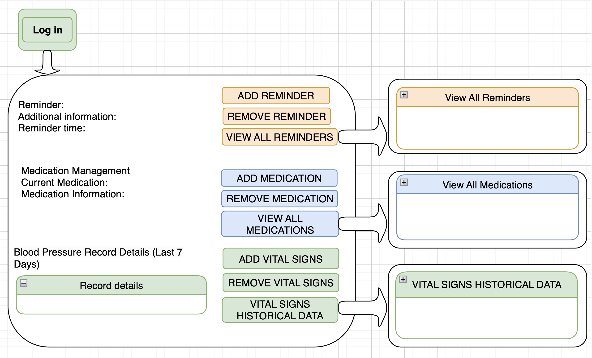

# Project Design Document - CareCompass Design

## 1. Problem Statement

Care Compass is a healthcare coordination platform designed to empower patients, caregivers, and healthcare providers with seamless access to essential healthcare tools, resources, and support.
Many discharged patients, especially older adults with long-term care needs, require ongoing monitoring and documentation of their health condition after leaving the hospital. Caregivers or family members often play a crucial role in managing the patient's health information, including medication schedules, vital signs, symptoms, appointments, and daily activities.

## 2. Top Questions to Resolve in Review

1. How can we create a unified platform that integrates various aspects of healthcare navigation, coordination, and support?
2. What features and functionalities should the Care Compass include to address the diverse needs of patients, caregivers, and healthcare providers?
3. How can we ensure that the Care Compass is user-friendly, accessible, and secure for all stakeholders?

## 3. Use Cases

U1. As a user, I would like to create a new medication record, so I can manage the medication schedule efficiently.

U2. As a user, I would like to delete a medication record, so I can keep the medication list up-to-date.

U3. As a user, I would like to view all medications for a specific user, so I can monitor and manage their medication intake.

U4. As a user, I would like to log a new set of vital signs, so I can track the patient’s health metrics over time.

U5. As a user, I would like to delete a specific vital signs record, so I can correct errors or remove outdated information.

U6. As a user, I would like to retrieve all vital signs entries for a specific user, so I can review their historical health data.

U7. As a user, I would like to set up new reminders for medication or vital signs monitoring, so I can ensure adherence to health management protocols.

U8. As a user, I would like to remove a specified reminder, so I can adjust notifications to current care requirements.

U9. As a user, I would like to retrieve all notifications set up for a specific user, so I can overview and manage all set reminders and alerts.

U10. As a user, I would like to update notifications for medication and vital signs monitoring, so I can keep the patient's care schedule timely and accurate.

U11. As a user, I would like to create a new blood glucose measurement to regularly monitor and manage the patient’s glucose levels.

U12. as a user, I would like to delete a blood glucose measurement to correct any errors or when it's no longer needed.

U13. as a user, I would like to view all blood glucose measurements for a specific user to analyze trends and adjust treatments.


## 4. Project Scope

### 4.1. In Scope

* Medication management and reminders
* Vital signs tracking and monitoring
* Notifications

### 4.2. Out of Scope
* Appointment scheduling and management
* Daily activity tracking and monitoring
* Symptom tracking and logging
* Integration with electronic health record (EHR) systems
* Real-time communication with healthcare providers
* Automated analysis of health data for diagnosis or treatment recommendations
* Automatic generation of reports and email delivery to doctors

Several potential features are currently designated as "out of scope" for the initial development phase of CareCompass. The decision to exclude these features was made primarily based on the following considerations:
The initial phase focuses on establishing a robust foundation with key functionalities that address the most pressing needs of our users. More complex features such as appointment scheduling, symptom tracking, and automated analysis of health data are planned for future updates, where additional time and resources can be dedicated to their development and integration.

## 5. Proposed Architecture Overview

The CareCompass application will be developed as a web-based platform,
accessible via web browsers on desktop. It will utilize a serverless
architecture using AWS Lambda functions and Amazon DynamoDB for data storage.
The front end will be built using modern web technologies such as HTML, CSS,
and JavaScript for dynamic user interfaces.

## 6. API

### 6.1. Public Models

```
// MedicationModel

String patientId;
String medicationName;
String prescription;
String instructions;        
```
```
// VitalSignModel

String patientId; 
LocalDateTime actualCheckTime;       
double temperature;              
int heartRate;
int pulse;
int respiratoryRate;
int systolicPressure;
int diastolicPressure;
int meanArterialPressure;
double weight;
PatientPosition patientPosition; // enum
int bloodOxygenLevel;
OxygenTherapy oxygenTherapy; // enum
FlowDelivered flowDelivered; // enum
PatientActivity patientActivity; // enum
String comments;        
```
```
// BloodGlucoseMeasurementModel
String patientId;                   
LocalDateTime actualCheckTime;
double glucoseLevel;
GlucoseMeasurementContext glucoseContext; // enum
String comments;    
```
```
// NotificationModel

String patientId;
String notificationId;
String notificationTitle;
String reminderContent;
LocalDateTime reminderTime;
ReminderType reminderType;  // enum
```

### Medication Management Reminder Endpoints
### 6.2. Create Medication Record Endpoint
* POST /medications
* Body: MedicationModel
* Description: Create a new medication entry for a patient.
* Response: Returns the newly created MedicationModel.
  

### 6.3. Delete Medication Endpoint
+ DELETE /medications/{patientId}
* Description: Deletes a specified medication entry based on the patientId, medicationName, and medicationTime..
* Response: Json object return success and message.

### 6.4. List All Medications Endpoint
* GET /medications/user/{patientId}
* Parameters: ?page=1&limit=30, ?fromDate=2022-01-01&toDate=2022-01-31, ?sortBy=date&order=asc
* Description: Retrieves all medications for a specific user.
* Response: List of medications with pagination data.

### Vital Signs Tracking Endpoints
### 6.5. Log Vital Signs Endpoint
* POST /vitals
* Body: VitalSignModel
* Description: Logs a new set of vital signs for a patient.
* Response: Returns the newly recorded VitalSignsMeasurementModel.

### 6.6. Delete Vital Signs Record Endpoint
* DELETE /vitals/{patientId}
* Description: Deletes a specified vital signs record based on patientId and timestamp.
* Response: Success or error message.
  
*
### 6.7. List All Vital Signs Endpoint
* GET /vital-signs/user/{patientId}
* Parameters: ?page=1&limit=30, ?fromDate=2022-01-01&toDate=2022-01-31, ?sortBy=date&order=asc
* Description: Retrieves all vital signs entries for a specific user.
* Response: List of vital signs with pagination data.

### Notification Management Endpoints
### 6.8. Add Notification for Medication
* POST /notifications
* Body: NotificationModel
* Description: Sets up a new reminder for medication or vital signs monitoring.
* Response: Returns the newly created NotificationModel.

### 6.9. Remove Notification Endpoint
* DELETE /notifications/{notificationId}
* Description: Removes a specified reminder using the notificationId.
* Response: JSON object return success and message.

### 6.10. List All Notifications Endpoint
* GET /notifications/user/{patientId} 
* Parameters: ?page=1&limit=30, ?fromDate=2022-01-01&toDate=2022-01-31, ?sortBy=date&order=asc
* Description: Retrieves all notifications set up for a specific user with pagination, filtering, and sorting.
* Response: List of NotificationModel entries with pagination data.
  

### 6.11. Update Notifications Endpoint
* PUT /notifications/{notificationId}
* Parameters: notificationId (URL Parameter): Unique identifier for the notification to be updated.
* Description: Updates an existing notification for a patient.
* Response: Success or error message. (e.g., 200 OK, 201 Created, 400 Bad Request, 404 Not Found, 500 Internal Server Error).

### 6.12. Create Blood Glucose Measurement Endpoint
* POST /bloodGlucoseMeasurements
* Body: BloodGlucoseMeasurementModel
* Description: Logs a new blood glucose measurement for a patient.
* Response: Returns the newly created BloodGlucoseMeasurementModel.

### 6.13. Delete Blood Glucose Measurement Endpoint
* DELETE /blood-glucose/{patientId}/{measurementTime}
* Body: { "patientId": String, "measurementTime": LocalDateTime }
* Description: Deletes a specified blood glucose measurement based on patientId and timestamp.
* Response: Success or error message.

### 6.14. List All Blood Glucose Measurements Endpoint
* GET /blood-glucose/user/{patientId}
* Parameters: ?page=1&limit=30, ?fromDate=2022-01-01&toDate=2022-01-31, ?sortBy=date&order=asc 
* Description: Retrieves all blood glucose measurements for a specific user with options for pagination, filtering, and sorting. 
* Response: List of BloodGlucoseMeasurementModel entries with pagination data.

## 7. Tables

### 7.1. `medications`
```
patientId // String (Partition Key)
medicationName // String (Sort Key)
prescription // String 
instructions // String 
```

### 7.2. `vitalSigns`
```
patientId // String (Partition Key)
actualCheckTime // LocalDateTime (Sort Key)
temperature // double 
heartRate // int 
pulse // int 
respiratoryRate // int 
systolicPressure // int 
diastolicPressure // int 
meanArterialPressure // int 
weight // double 
patientPosition // PatientPosition (enum)
bloodOxygenLevel // int enum
oxygenTherapy // OxygenTherapy (enum)
flowDelivered // FlowDelivered
patientActivity // PatientActivity (enum)
comments // String 
```
## 7.3. `notifications`
```
patientId // String (Partition Key)
notificationId // String (Sort Key)
notificationTitle // String 
reminderContent // String 
reminderTime // LocalDateTime 
```
## 7.4. `bloodGlucoseMeasurements`
```
patientId // String (Partition Key)
frequency // String (Sort Key)
actualCheckTime // LocalTime 
glucoseLevel // double
glucoseContext // GlucoseMeasurementContext  (enum)
comments // String 
```
### 7.5. `GSI vitalSignsDateIndex`
```
patientId // Partition Key, String
actualCheckTime // LocalDateTime (Sort Key)
```

## 8. Pages




## Technologies Used

* Programming Languages: Java, JavaScript.
* AWS Services: AWS Lambda, AWS API Gateway, Amazon DynamoDB, Amazon S3, AWS CloudFormation, AWS CloudWatch, AWS CloudFront.
* Web Technologies: HTML, CSS.
* Development Tools: Docker, Gradle, Git, GitHub.
* Software Development Practices: Object-Oriented Programming (OOP), Test-Driven Development (TDD).
* Additional Libraries/Frameworks: Google Guava, Amazon Cognito, Dagger.
